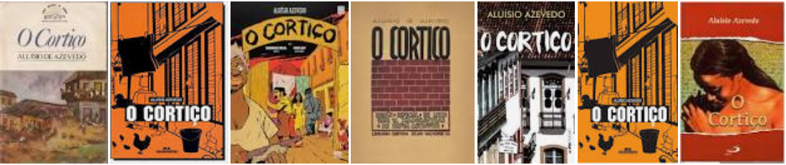

# Instruções

1.  De acordo com sua preferência, selecione um texto (ou mais de um,
    caso deseje). Pode ser uma notícia, um artigo de jornal (revista),
    um discurso, um script de filme, um roteiro de história em
    quadrinhos, um capítulo de livro ou algo do gênero. Escreva o texto
    ou informe sua fonte.

2.  Importe o texto para o R e limpe-o: retire pontuação, símbolos,
    números (se não forem relevantes) e stopwords. Em seguida, faça um
    gráfico de barras com as 10 palavras mais frequentes e uma nuvem de
    palavras. Pode-se utilizar os pacotes wordcloud e/ou wordcloud2.

3.  (Não obrigatório) Faça quaisquer outras análises do texto que julgar
    interessante ou relevante.

*A atividade deve ser feita no `R Markdown` e entregue em HTML ou PDF
com os códigos explicitados e as análises comentadas. Os gráficos devem
ser explicativos, com nomes corretos nos eixos, por exemplo.*

# Execução

## Intalando Pacotes

```{r eval=T, warning=FALSE, message=FALSE}
library(knitr)
library()
library(dplyr)
library(rmdformats)
library(tm)
library(pdftools)
library(ggplot2)
library(stringi)
library(wordcloud)

knitr::opts_chunk$set(
	echo = TRUE,
	message = FALSE,
	warning = FALSE)
```

## Coletando Dados

O texto avaliado será o livo "O Cortiço" de Alvares de Azevedo



[\<\<Link para o
livro\>\>](http://objdigital.bn.br/Acervo_Digital/Livros_eletronicos/cortico.pdf)

```{r}
x<-pdf_text(pdf ="http://objdigital.bn.br/Acervo_Digital/Livros_eletronicos/cortico.pdf")
#pdf_text uado para extrair texto do pdf
```

## Tratamento

Criando um objeto do tipo `tm::Corpus` por meio da função
`tm::VectorSource` que interpreta cada elemento do vetor x como um
documento. Neste caso cada página do livro em formato pdf é um elemento
incorporado ao objeto.

```{r}
cortico <- Corpus(VectorSource(x))
```

As funções abaixo, ajudarão no processamento do texto, padronizando
letras minusculas; removendo números, pontuação, acentos e caracteres
especiais; e transformando palavras e termos.

O mecanismo que processará a maioria dos ajustes no texto virá da função
`tm_map` do pacote `tm`.

```{r}
cortico <- tm_map(cortico, tolower)           # todas minusculas
cortico <- tm_map(cortico, removePunctuation) # remove pontuação
cortico <- tm_map(cortico, removeNumbers)     # remove numeros
```

Para remoão dos acentos foi necessário utilizar a função
`stri::stri_trans_general`. Outra função que pode fazer este trabalho é
a `iconv`, no entanto não foi obtido o resultado esperado.

```{r}
#Função para remover todos os Acentos
Tirar<-function(x) stri_trans_general(x,"Latin-ASCII")

for (i in seq(cortico)){
  cortico[[i]]$content<-Tirar(cortico[[i]]$content)
}

#inspect(cortico[1])
```

Segundo o [@wiki:StopWords], *stopword* é uma palavra que é removida
antes ou após o processamento de um texto em linguagem natural. São as
palavras mais comuns de uma língua, como conjunções, preposições e
artigos utilizadas como elemento de ligação entre orações ou seus
termos.

Algumas discursões são travadas quanto a remoção ou não das stopwords,
as quais não serão abordadas neste trabalho, o qual removerá as
stopwords.

Após a remoção das stopwords é conveniente remover os espaços vazios
duplos.

```{r}
myStopwords <- c(stopwords('portuguese'),readLines("Stopwords_Portugues.txt"))

cortico <- tm_map(cortico, removeWords, myStopwords)  # remove stopwords 
cortico <- tm_map(cortico, stripWhitespace)           # remove espaçoes duplos

#inspect(cortico[1])
```

Ajuste de termos compostos comuns ao texto como os nomes dos personagens
principais :

```{r}
# Ajuste por conta da palavra estrutura
for (i in seq(cortico)){
  cortico[[i]]<- gsub("joao romao","joao.romao",cortico[[i]])
  cortico[[i]]<- gsub("rita baiana","rita.baiana",cortico[[i]])
  cortico[[i]]<- gsub("cabeca de gato","cabeca.de.gato",cortico[[i]])
  cortico[[i]]<- gsub("homens","homem",cortico[[i]])
  cortico[[i]]<- gsub("mulheres","mulher",cortico[[i]])
}
```

## Análise

Após o pré-processamento do texto, precedemos com algumas análises.

A função `tm::DocumentTermMatrix` cria uma matriz dos termos dos
documentos presentes no corpus, neste caso, de cada página do livro.

O parâmetro control nos auxilia na filtragem de termos com determinado
tamanho e frequência, no nosso estudo estamos pegando palavras de 5 a 46
(*maior palavra de língua portuguesa tem 46 caracteres:
"pneumoultramicroscopicossilicovulcanoconiótico"*) caracteres com 6
ocorrências, pelo menos.

```{r}
data.Dtm = DocumentTermMatrix(cortico, 
                              control=list(wordLengths=c(5,46),
                                           bounds=list(global = c(6,Inf))))
```

### Explorando

```{r}
mat = as.matrix(data.Dtm)
#rm(Freq)
freq = sort(colSums(mat), decreasing=TRUE)
Freq = data.frame(word=names(freq), freq=freq)
rm(freq);rownames(Freq)<-c()

kable_classic(kable(Freq[Freq[,2]>50,],
                    caption = "Lista dos Termos de 'O Cortiço' com mais de 50 ocorrências"),
              full_width = T, html_font = "Cambria")
```

## Gráfico de Frequência

```{r}
#Gráfico de frequencias
p <- ggplot(Freq[1:10,],aes(reorder(word,-freq),freq))+
            geom_col() +
            scale_y_continuous(limits = c(0, max(Freq[,2])+20))+
            geom_text(aes(label = freq), vjust = -1) +
            ggtitle("Frequência dos Termos de Maior Ocorrência de 'O Cortiço' ")+
            geom_bar(stat="identity")+
            labs(x="Termos",y="Frequência absoluta", subtitle = "Top 10")+
            theme(axis.text.x=element_text(angle=45,hjust=1))
plot(p)
```

## Nuvem de Palavras

```{r}

wordcloud(words=Freq$word,
          freq=Freq$freq,
          scale=c(3,0.3),
          min.freq=30,
          max.words=1000,
          random.order=F,
          random.color=1,
          rot.per=.2,
          use.r.layout=T, 
          colors=brewer.pal(5, "Dark2"))

# Funciona no Rstudio mas na compilação não aparece no html :[
# wordcloud2(Freq,
#           size =0.5,
#           minSize = 10,
#           color="random-light")
```

## Análises Adcionais

Em *Text Mining*, geralmente se obtém matrizes muito grandes, com muitas
células zero. Pode ser inteligente não armazenar todas as células uma a
uma na memória, mas apenas armazenar as poucas entradas diferentes de
zero + suas posições para economizar memória.

Assim devemos remover os termos que não aparecem com muita frequência.
Uma forma possível é remover qualquer elemento que não apareça em pelo
menos x% das entradas, neste caso 30% (`sparse=0.70`).

```{r}
# print("---------------Original DTM -----------------")
# print("-----90% da matrix com 0 'zeros' ------------")
inspect(data.Dtm)

# print("--------------Removed sparce DTM ------------")
# print("-----56% da matrix com 0 'zeros' ------------")
removeSparseTerms(data.Dtm, sparse = 0.7)
mat2<-as.matrix(removeSparseTerms(data.Dtm, sparse = 0.7))
```

### Dendograma

Montando uma representação de cluster, meramente ilustraiva.

Esta representação pode auxiliar em uma análise de possíveis
núcleos/temática dentro no contexto do obra estudada.

```{r}

fclust<-hclust(dist(scale(mat2)),method="ward.D")
plot(fclust)
rect.hclust(fclust,h=17)
```

### Mapa Relacional

Mais uma representação, meramente ilustrativa, a partir das correlações
entre os termos.

Foi definido uma correlação de `0.10`entre os termos com frequência
igual ou superior a `80`.

Este mapa pode ser uma ferramenta analítica dos relacionamentos entre os
personagens, por exmplo.

```{r}
a<-findFreqTerms(data.Dtm, lowfreq=80)

plot(data.Dtm,
     terms=a,corThreshold=0.1,
     attrs=list(node=list(shape="rectangle",fixedsize=F,fontsize="25"),
                edge=list(color="black")))
```
